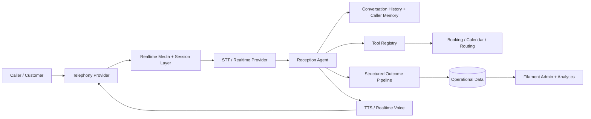

# VoiceOps Agent

**A modular Laravel voice-agent system for governed inbound/outbound calling, realtime conversation, messaging and operational handoff workflows.**

## Overview

VoiceOps Agent is a communications module built around programmable telephony and conversational AI. It combines provider abstractions, call/session state, realtime media handling, structured outcomes, caller memory, booking workflows, billing metering and administration surfaces.

The code is strongest as an example of **voice AI systems engineering**: telephony is separated from STT/TTS/realtime providers through contracts, while conversation logic, memory, tools and structured outputs live in a separate AI layer.

## Key Capabilities

- Inbound and outbound voice calling through Twilio integration.
- SMS and WhatsApp channel support.
- Provider contracts for telephony, STT, TTS, realtime voice, calendar and SIP capabilities.
- Twilio Media Streams relay and realtime session handling.
- ElevenLabs realtime/voice integration with fallback paths.
- OpenAI-compatible AI driver abstraction.
- Receptionist agent and persona resolution.
- Database and in-memory chat-history implementations.
- Sliding-window and summarisation context strategies.
- Caller profile memory and conversation embedding-store boundary.
- Declarative AI tool registry/execution patterns.
- Typed structured call outcomes and JSON-schema-oriented output models.
- Booking/reception workflows and calendar federation.
- Transfer routing, missed-call recovery and provider failover components.
- Usage/cost metering and idempotent voice-seconds accounting.
- Filament administration resources and builder UI.
- Webhook validation and realtime session-token security.

## Architecture



## Example Workflow

1. An inbound call reaches the configured telephony provider.
2. The webhook/session layer validates and records the call context.
3. Realtime media is relayed to the configured speech/realtime provider.
4. The receptionist pipeline combines persona, conversation history and caller context.
5. The agent can invoke registered business tools such as booking/routing operations.
6. Conversation results are extracted into a typed call-outcome model.
7. Usage, call state and outcome evidence are persisted for administration and follow-up.
8. When realtime services are unavailable, configured fallback behavior can return a simpler Gather/Say flow.

## Tech Stack

| Area | Technology |
|---|---|
| Language | PHP 8.1+ |
| Backend | Laravel 10+ modular package |
| Admin | Filament v3 |
| Telephony | Twilio |
| Voice / TTS | ElevenLabs; provider abstraction |
| AI | OpenAI-compatible driver layer |
| Data | Laravel database models/migrations |
| Interfaces | REST/webhooks, TwiML, realtime media endpoints |

## Engineering Highlights

### Provider abstraction
Telephony, speech and realtime behavior are expressed through contracts rather than hard-wired into the agent. That keeps conversation/business logic separable from provider-specific transports.

### Structured conversation outcomes
Calls can be reduced to typed outcome data instead of remaining only as free-form transcripts. This is a useful boundary for downstream CRM, analytics and workflow automation.

### Context and memory strategies
The AI layer includes interchangeable chat-history implementations and truncation strategies, plus caller-oriented memory components. These address the practical context-window and continuity problems of long-running conversational systems.

### Realtime safety and operational fallback
The module includes webhook validation, signed realtime session tokens, media-stream components and fallback paths when optional voice services are unavailable.

### Usage accounting
Voice usage is represented through dedicated metering/billing components, including idempotent accounting behavior, rather than being mixed into conversational logic.

## Getting Started

This repository currently contains the CallingAgent as a module rather than a complete standalone Laravel host application.

The module readiness documentation identifies:

- Laravel 10+;
- optional Filament v3 for admin resources;
- optional `twilio/sdk` for live Twilio calls;
- provider credentials configured through the module environment variables.

See `Modules/CallingAgent/.env.example` and the module configuration files before integration.

## Repository Structure

```text
Modules/CallingAgent/
├── AI/                 Agents, drivers, history, memory, tools and outputs
├── Billing/            Usage and voice metering
├── Config/             Provider and feature configuration
├── Contracts/          Telephony/speech/realtime interfaces
├── Database/           Module migrations
├── Filament/           Admin pages/resources/plugin
├── Http/               Controllers, webhooks and middleware
├── Services/           Provider implementations and realtime services
├── Tests/              Module feature/readiness tests
└── Support/            Validation, source map and readiness evidence
```

## Status

**In Development / Advanced Module.** A broad implementation is present, but the repository's own readiness report records remaining integration work, including wiring the OpenAI-compatible driver into the receptionist response path, database-history migration work, usage integration and additional realtime/tool event wiring.

## Provenance

The AI core explicitly documents design patterns adapted from the open-source LarAgent project, while the repository contains its own CallingAgent module, telephony/realtime/provider layers and operational integrations. Source/provenance records are retained under the module support and legacy-source directories.

## License

No root license was verified during this pass. Review the retained source licenses and add a repository-level license before redistribution.

---

**Jason Lee**  
GitHub: [@Masterleeaus](https://github.com/Masterleeaus)
